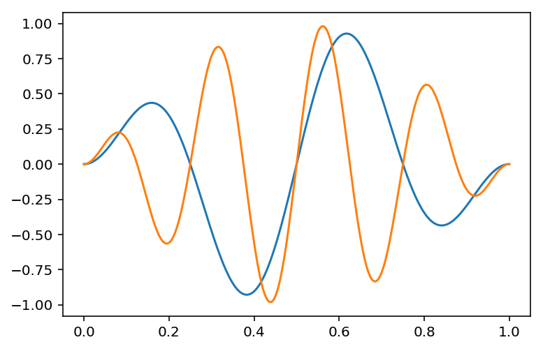

# 键盘快捷键

在这个笔记本中，你会得到一些关于使用键盘快捷键的练习。这是熟练使用笔记本的关键，能够很大程度地帮助你提高你的工作速度。

首先，在编辑模式和命令模式间相互切换。在编辑模式中你可以键入单元格，在命令模式你可以敲击键盘来执行命令，例如创建一个新的单元格和打开一个命令面板。当你选择一个单元格时，你可以通过单元格框线的颜色来分辨出你当前正在使用的模式。在编辑模式中，左边粗框线是绿色的。在命令模式中，左边粗框线是蓝色的。在编辑模式中，你能在单元格中看到一个光标。

默认情况下，当你能够创建一个新的单元格或者可以移动到下一行，那么你就在命令模式。要进入编辑模式，按Enter或者Return。要从编辑模式返回到命令模式，按Escape。

> **练习：** 点击这个单元格，然后按Enter + Shift到下一个单元格。在编辑模式和命令模式间来回切换几次练习


```python
# 练习切换模式
print "test"
```

    test


```python
## 命令模式中的帮助命令

如果你需要查找一个命令，你可以通过在命令模式中按H调出快捷方式列表。上面的帮助列表也提供了键盘快捷键。你可以去试试。
```

## 创建一个新的单元格

最常见的命令之一是创建一个新的单元格。你可以通过在命令模式按 `A` 在当前单元格上方创建一个单元格。按 `B` 在当前选定的单元格下方创建一个单元格。


```python
test
```


    ---------------------------------------------------------------------------

    NameError                                 Traceback (most recent call last)

    <ipython-input-2-d8e8fca2dc0f> in <module>()
    ----> 1 test
    

    NameError: name 'test' is not defined


> **练习：** 使用键盘命令在此单元格上方创建一个单元格。

> **练习：** 使用键盘命令在此单元格下方创建一个单元格。


```python
print "hello"
```

    hello


## 在Markdown和代码间相互切换

通过使用键盘快捷键，可以很快很简单地在Markdown和代码单元格之间相互切换。从Markdown切换到单元格，按 `Y` 。从代码切换到Markdown，按 `M`。

> **练习：** 在Markdown和代码单元格之间相互切换单元格。


```python
## 在这里练习

def fibo(n): # 递归斐波拉契数列！
    if n == 0:
        return 0
    elif n == 1:
        return 1
    return fibo(n-1) + fibo(n-2)
```

## 行号

很多时候出于调试的目的在代码中对代码进行编号是很有用的。你可以在命令模式中的代码单元格按 `L` 打开数字。

> **练习：** 在上面的代码单元格中打开和关闭行号。

## 删除单元格

在一行连续按两次 `D` 可以删除单元格。这是为了防止出现意外的删除，所以你必须连续按两次键。

> **练习：** 删除下面的单元格。

print "test"

## 保存笔记本

笔记本每隔一段时间会自动保存，但是如果你想在这些时间内保存你的工作，按 `S` 去保存笔记本。如此简单！

## 命令面板

通过按Shift + Control或者Command + P，你可以很轻松地访问命令面板。

> **注意：** 很不幸，在火狐浏览器和Internet Explorer浏览器中命令面板不能工作，在这些浏览器中已经有一些功能赋值给这些快捷键。在谷歌浏览器和Safari浏览器中可以正常打开命令面板。


你可以在弹出的命令面板中搜索不能用键盘快捷键实现的命令。例如，工作栏上有按钮可以实现上下移动单元格的命令（上下箭头），但是没有相对应的键盘快捷键。要把一个单元格向下移动，你可以打开命令面板键入"move"就会出现移动命令。

> **练习：** 使用命令面板把单元格向下移动一个位置。


```python
# 下移此单元格
```


```python
# 至该单元格下方
```

## 完成

你还可以做更多，比如复制、剪切、粘贴单元格。我建议你要去习惯使用键盘快捷键，那么你能够更加便捷地在笔记本中工作。当你熟练地掌握这些快捷键后，你很少需要把你的手从键盘移开去使用鼠标，这会极大地提高你的工作效率。

记住，如果你需要去查看快键键，只需要在命令模式中按 `H` 。


```python
from math import sqrt

def fibo1(n):
    if n == 0:
        return 0
    elif n == 1:
        return 1
    return fibo1(n-1) + fibo1(n-2)
```


```python
from math import sqrt

def fibo2(n):
    return ((1+sqrt(5))**n - (1-sqrt(5))**n)/(2**n*sqrt(5))
```


```python
%timeit fibo2(20)
```

    The slowest run took 12.96 times longer than the fastest. This could mean that an intermediate result is being cached.
    1000000 loops, best of 3: 680 ns per loop


```python
%timeit fibo1(20)
```

    100 loops, best of 3: 3.27 ms per loop


```python
%%timeit 
fibo1(30)
fibo2(30)
```

    1 loop, best of 3: 395 ms per loop


```python
%matplotlib inline
%config InlineBackend.figure_format = 'retina'

import matplotlib.pyplot as plt
import numpy as np
```


```python
x = np.linspace(0, 1, 300)
for w in range(2, 6, 2):
    plt.plot(x, np.sin(np.pi*x)*np.sin(2*w*np.pi*x))
```





```python
%pdb
```

    Automatic pdb calling has been turned ON


```python
numbers = 'hello'
sum(numbers)
```


    ---------------------------------------------------------------------------

    TypeError                                 Traceback (most recent call last)

    <ipython-input-59-7a179164921f> in <module>()
          1 numbers = 'hello'
    ----> 2 sum(numbers)
    

    TypeError: unsupported operand type(s) for +: 'int' and 'str'


    > <ipython-input-59-7a179164921f>(2)<module>()
          1 numbers = 'hello'
    ----> 2 sum(numbers)
    
    ipdb> print type(numbers)
    <type 'str'>
    ipdb> q


```python

```
